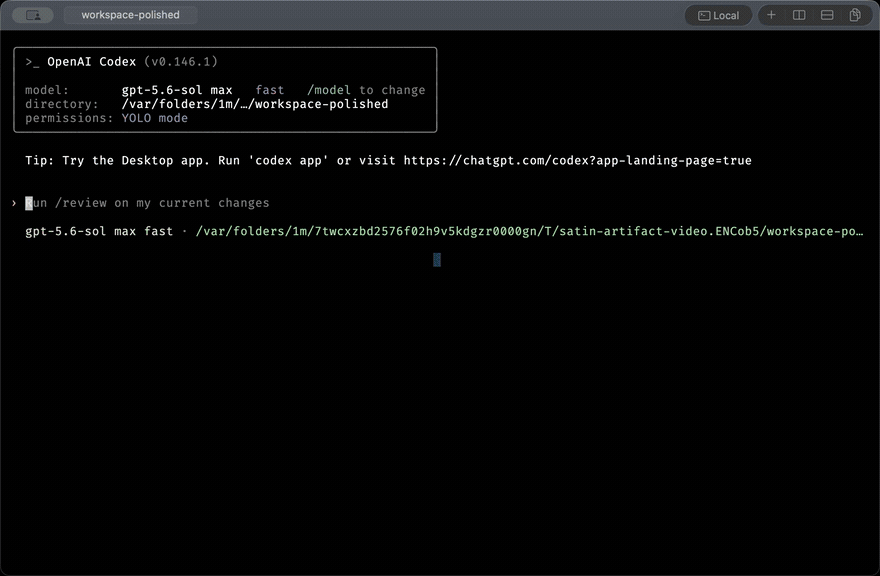

<p align="center">
  
</p>

<h1 align="center">Satin</h1>

<p align="center">
  A native macOS terminal built around AI and tmux, designed to make Neovim
  workflows feel great.
</p>

<p align="center">
  <a href="https://github.com/soyukke/satin/releases/latest"></a>
  <a href="https://github.com/soyukke/satin/actions/workflows/macos.yml"></a>
  <a href="LICENSE"></a>
</p>

<p align="center">
  <a href="assets/satin-demo.mp4">
    
  </a>
</p>

<p align="center">
  <sub>Native tmux projection, terminal scrollback, and smooth native Neovim
  scrolling. Click for the 19-second MP4.</sub>
</p>

## Why Satin

Satin assumes a terminal workflow where AI agents work alongside you, tmux
keeps sessions alive, and Neovim remains at the center of editing.

It brings those workflows into a native macOS workspace without asking Neovim
users to give up the way they work. Motion is part of that experience: it
should feel good, look good, and help the eye follow cursor movement, scrolling,
and changes across the workspace.

## Highlights

- A real PTY and `libghostty-vt`-backed terminal core, with AppKit owning the
  macOS window, menus, tabs, pane layout, settings, and input translation.
- Neovide-style animated cursor movement and retained smooth scrolling,
  designed to feel good, look good, and make movement easier to follow.
- A unified native Neovim UI backed by `nvim --embed`, `ext_multigrid`, and the
  same Skia/Metal renderer whether it is opened from the shell or Command-N.
- Explicit local `tmux -CC` integration that projects tmux windows, panes, zoom,
  history, alternate screens, terminal modes, and bells as native tabs and
  splits, then reattaches that projection after a clean Satin restart. A native
  session picker switches, creates, attaches, and detaches local sessions;
  ordinary `tmux attach` remains a terminal TUI.
- A release-matched skill, available through `satin skill`, that lets terminal
  AIs identify their pane and operate tabs, splits, input, status, and artifacts
  through an owner-only local control socket.
- Experimental bounded, versioned Markdown artifacts with a native
  recent-artifact popover. The terminal viewer renders GFM tables, inline
  emphasis, syntax-highlighted fenced code, and snapshotted relative PNG images
  without an embedded browser.
- Native tabs, recursive splits, working-directory inheritance, and session
  restore.
- An on-demand Work Switcher for finding tabs and panes by title, directory,
  tmux session, or agent status, with inline activity excerpts, a current-screen
  text preview, a compact toolbar attention badge, and lifecycle updates from
  Codex and Claude Code without reading terminal screen text.
- Native copy/paste, IME, terminal rectangular selection, Neovim message-area
  drag selection, scrollback search, clickable links, and a scroll indicator.
- A native Settings window for appearance, shell, startup directory,
  keybindings, session behavior, and signed updates.
- Finder Open With, Dock drops, and a macOS Service for opening files or folders
  directly in a focused editor tab without restoring the normal workspace.
- Kitty graphics in terminal panes and image.nvim-backed native Neovim panes.
- Publisher-signed in-app updates distributed through GitHub Releases.

## Experimental: AI artifacts

Artifacts are experimental. Ask a terminal AI to use Satin's embedded skill and
it can turn a response into a bounded Markdown artifact, then open the snapshot
beside its working pane as a native split. The release-matched skill is exposed
by Satin itself, so there is no separate plugin to install.

<p align="center">
  <a href="assets/satin-artifact-demo.mp4">
    
  </a>
</p>

<p align="center">
  <sub>One prompt becomes a Markdown report with a table, highlighted code, and
  the current Satin icon. Click for the 16-second MP4.</sub>
</p>

## Requirements

- Apple Silicon Mac
- macOS 14 or newer

Intel Macs are not supported.

## Install

1. Download the macOS arm64 ZIP from the
   [latest GitHub Release](https://github.com/soyukke/satin/releases/latest).
2. Extract `Satin.app` and move it to `/Applications`.
3. Launch the application from `/Applications`.

Public release archives are publisher-signed for the in-app updater but are
not currently notarized with an Apple Developer ID. On first launch, macOS may
require Control-clicking the app and choosing Open, or allowing it from
System Settings → Privacy & Security. Later releases can be installed from
Help → Check for Updates… → Update and Restart.

## tmux and Neovim

Install tmux 3.2 or newer, then run `tmux -CC attach` or `tmux -CC new-session`
inside Satin to project tmux windows and panes as native tabs and splits. The
session picker in the toolbar can create, switch, attach, and detach local
sessions. Satin detects the user-owned tmux from the configured login shell and
uses its absolute path consistently; override it under Satin → Settings… →
Terminal when needed. A clean Satin restart reattaches the last projected
session; ordinary `tmux attach` stays inside the terminal as a TUI.

Running interactive `nvim` directly from Satin's supported shell integration,
or choosing File → Open Native Neovim, uses the native `nvim --embed`
multigrid renderer. Quitting Neovim resumes the same shell. Nested tmux/SSH,
headless, remote, stdin-driven, and `SATIN_NVIM_TUI=1` invocations retain normal
terminal-mode behavior.

Kitty graphics work in terminal panes, native Neovim panes, and projected tmux
panes. Configurations that already load image.nvim need no Satin-specific setup.

For an image.nvim spec that is otherwise disabled in GUI clients, allow Satin's
advertised bridge explicitly:

```lua
cond = function()
  local satin = vim.g.satin_features
  return not vim.g.neovide or (satin and satin.kitty_graphics)
end
```

Satin sets this capability before user configuration; users must not set it
themselves. The condition is needed only when a configuration otherwise
disables image.nvim in every GUI client.

## Open files from Finder

After Satin is installed in `/Applications`, select a file or folder in Finder
and choose Open With → Satin, drag it onto Satin in the Dock, or use Services →
Open in Satin Editor. When this launches Satin, it opens one tab and one pane,
starts the configured editor immediately, and leaves the saved terminal session
untouched. If Satin is already running, the selection opens in a new tab.

The default Finder editor is `nvim`. Interactive Neovim uses Satin's native
multigrid compositor; choosing `vim` or another terminal editor keeps it in the
PTY terminal. Change the executable name or absolute path under Satin →
Settings… → Terminal → Finder editor. The field accepts an executable only, not
shell arguments; every selected path is passed as a separate protected argv
item.

## Settings

Open Satin → Settings… or press `Command-,`.

- General controls Option-as-Alt, bell attention, and session restore.
- Appearance selects a fixed-pitch font, font size, and theme. Font changes
  apply immediately to every pane; theme changes update the current tab and
  become the default for new tabs.
- Terminal selects an executable absolute shell path, an existing startup
  directory for new panes, the tmux executable, and the executable opened by
  Finder document events. Empty shell, directory, and tmux values use the login
  shell, inherit the active working directory, and detect tmux automatically;
  the Finder editor defaults to `nvim`.
- Keybindings customizes session, pane, Neovim, zoom, and update commands.
  Invalid, duplicate, and standard app-reserved shortcuts are rejected.
- Updates enables signed checks and selects every-launch, daily, or weekly
  frequency.

Invalid stored paths, removed fonts, or corrupt keybindings are repaired to
safe defaults during load so preferences cannot prevent startup.

## Local control API

Every pane receives `SATIN_SOCKET`, `SATIN_TAB_ID`, `SATIN_PANE_ID`, and
`SATIN_CLI`, and can invoke:

```sh
"$SATIN_CLI" skill
"$SATIN_CLI" identify --json
"$SATIN_CLI" list --json
"$SATIN_CLI" read-screen
"$SATIN_CLI" new-tab --cwd "$PWD" --title project --background
"$SATIN_CLI" split --vertical --background
"$SATIN_CLI" select-tab --tab 2
"$SATIN_CLI" move-tab --tab 2 --index 0
"$SATIN_CLI" close-pane --pane 3
"$SATIN_CLI" status set running "working"
"$SATIN_CLI" status wait --timeout 300
```

The app bundle also contains `Contents/MacOS/satin` for external scripts.
Its directory is prepended to the pane's initial `PATH`; use `$SATIN_CLI` when
a shell startup file replaces `PATH`. Targets use stable IDs from `list`, while
tab movement alone uses its zero-based presentation index. `--background`
creates and starts a tab or split and then restores the previously selected
tab and pane.
In the bundled zsh integration, ordinary Codex and Claude Code launches mark a
new lifecycle session, and Claude Code also receives Satin's release-matched
hooks as an additional CLI settings layer. Existing Claude settings remain
loaded.
`command codex`, an explicit `claude --settings ...`, `claude --bare`,
`command claude`, or `SATIN_DISABLE_AGENT_INTEGRATION=1` retains an opt-out path.
Activity then uses emitted terminal-title events, so Satin does not replace the
user's single machine-level Codex `notify` command.
The Unix socket is owner-only, verifies the peer UID, and has bounded request,
client, and timeout limits; it is not a remote-control interface. See
[`docs/satin-cli.md`](docs/satin-cli.md) for commands, JSON behavior, and the
security boundary.

## Native Shortcuts

- `Command-T`: new tab
- `Command-P`: search and focus open tabs and panes with the Work Switcher
- `Command-D` / `Command-Shift-D`: vertical / horizontal split
- `Command-W`: close the active pane
- `Control-Command-H/J/K/L`: focus the pane to the left / down / up / right
- a borderless new-tab action immediately after the native tab strip
- per-pane `×`, vertical split, and horizontal split actions
- right-side toolbar actions for the Artifact sidebar and Work Switcher
- `Command-N`: open the unified native Neovim UI while retaining the current shell
- `Command-C`, `Command-V`, `Command-A`, `Command-F`: copy, paste, select all,
  and scrollback search
- `Command-+`, `Command--`, `Command-0`: pane-local terminal font size,
  including panes projected from a native tmux session

## Build from source

```sh
./scripts/dev
```

or:

```sh
nix develop --command just terminal
```

The Nix flake provides the development dependencies; Xcode is also required.
No Homebrew-managed dependencies are needed. `just terminal` launches an
isolated, purple-icon `Satin Dev.app` with separate preferences and session
state. Use `just terminal-foreground` when debugging attached build and runtime
logs.

## Development

Run `just` to list the build, test, smoke, release, and maintenance recipes in
the repository [`justfile`](justfile). Before publishing a change, run
`just precommit`; the publication-grade native gate is `just quality`. Install
the bundled pre-commit hook once per clone with `just install-hooks`.

Architecture Decision Records live in [`docs/adr`](docs/adr). Current renderer
behavior and its visual smoke matrix are in
[`docs/renderer.md`](docs/renderer.md); release packaging, signing, and update
operations are in [`docs/release.md`](docs/release.md). Native AppKit host code
lives in [`spikes/macos-shell`](spikes/macos-shell). The enforced OSS quality
and security baseline is documented in [`docs/quality.md`](docs/quality.md).

Report vulnerabilities through GitHub's private vulnerability reporting flow,
as described in [`SECURITY.md`](SECURITY.md), rather than a public issue.

## Contributing

Bug reports and focused feature requests are welcome through GitHub Issues.
Accepted pull requests are currently limited to repository maintainers;
external pull requests are closed automatically without checking out or
executing their contents. See [`CONTRIBUTING.md`](CONTRIBUTING.md) for the
issue-first contribution process, development setup, test policy, and required
checks. Community participation is governed by the
[`CODE_OF_CONDUCT.md`](CODE_OF_CONDUCT.md).

## License

The Satin source is available under the [MIT License](LICENSE),
copyright © 2026 soyukke. Adapted code, bundled fonts, and other third-party
components remain under their respective licenses as documented in
[`THIRD_PARTY_NOTICES.md`](THIRD_PARTY_NOTICES.md). Release bundles include
these notices, the full font license, and generated Rust dependency license
texts under `Contents/Resources/Legal/`; Help → Acknowledgements… reveals them.
