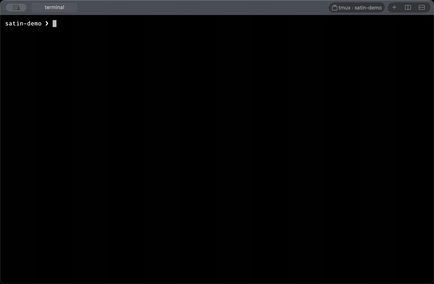

<p align="center">
  
</p>

<h1 align="center">Satin</h1>

<p align="center">
  A native macOS terminal with tabs, splits, animated cursor movement, and smooth scrolling.
</p>

<p align="center">
  <a href="https://github.com/soyukke/satin/releases/latest"></a>
  <a href="https://github.com/soyukke/satin/actions/workflows/macos.yml"></a>
  <a href="LICENSE"></a>
</p>

> [!IMPORTANT]
> Existing Neovide Tabs installations should first update to the signed
> [0.1.7 migration bridge](https://github.com/soyukke/neovide-tabs/releases/tag/v0.1.7).
> Its in-app updater installs `Satin.app` from this repository without breaking
> the existing Ed25519 trust chain or discarding settings and session state.

<p align="center">
  <a href="assets/satin-demo.mp4">
    
  </a>
</p>

<p align="center">
  <sub>Native tmux windows and panes as macOS tabs and splits. Click for the
  12-second MP4.</sub>
</p>

Satin combines a Rust terminal core and Neovide-derived Skia/Metal
renderer with a native AppKit shell. Terminal bytes flow through a real PTY and
`libghostty-vt`, while AppKit owns the macOS window, menus, tabs, pane layout,
settings, and input translation.

## Highlights

- Native tabs, recursive splits, working-directory inheritance, and session
  restore.
- Neovide-style animated cursor movement and retained smooth scrolling.
- Native copy/paste, IME, terminal rectangular selection, Neovim message-area
  drag selection, scrollback search, clickable links, and a scroll indicator.
- A native Settings window for appearance, shell, startup directory,
  keybindings, session behavior, and signed updates.
- A unified native Neovim UI backed by `nvim --embed`, `ext_multigrid`, and the
  same Skia/Metal renderer whether it is opened from the shell or Command-N.
- Finder Open With, Dock drops, and a macOS Service for opening files or folders
  directly in a focused editor tab without restoring the normal workspace.
- Kitty graphics in terminal panes and image.nvim-backed native Neovim panes,
  plus an owner-only `satin` automation interface.
- Explicit local `tmux -CC` integration that projects tmux windows, panes, zoom,
  history, alternate screens, terminal modes, and bells as native tabs and
  splits, then reattaches that projection after a clean Satin restart. A native
  session picker switches, creates, attaches, and detaches local sessions;
  ordinary `tmux attach` remains a terminal TUI.
- Publisher-signed in-app updates distributed through GitHub Releases.

## Requirements

- Apple Silicon Mac
- macOS 14 or newer

Intel Macs are not supported.

## Install

1. Download the macOS arm64 ZIP from the
   [latest GitHub Release](https://github.com/soyukke/satin/releases/latest).
2. Extract `Satin.app` and move it to `/Applications`.
3. Launch the application from `/Applications`.

Public release archives are publisher-signed for the in-app updater but are
not currently notarized with an Apple Developer ID. On first launch, macOS may
require Control-clicking the app and choosing Open, or allowing it from
System Settings → Privacy & Security. Later releases can be installed from
Help → Check for Updates… → Update and Restart.

## Open files from Finder

After Satin is installed in `/Applications`, select a file or folder in Finder
and choose Open With → Satin, drag it onto Satin in the Dock, or use Services →
Open in Satin Editor. When this launches Satin, it opens one tab and one pane,
starts the configured editor immediately, and leaves the saved terminal session
untouched. If Satin is already running, the selection opens in a new tab.

The default Finder editor is `nvim`. Interactive Neovim uses Satin's native
multigrid compositor; choosing `vim` or another terminal editor keeps it in the
PTY terminal. Change the executable name or absolute path under Satin →
Settings… → Terminal → Finder editor. The field accepts an executable only, not
shell arguments; every selected path is passed as a separate protected argv
item.

## Build from source

```sh
./scripts/dev
```

or:

```sh
nix develop --command just terminal
```

The development environment is managed by the repository's Nix flake and
requires Xcode. `libghostty-vt-sys` currently needs Zig 0.15.2 for the Ghostty
commit it builds, so the flake uses `nixpkgs#zig_0_15`. No Homebrew-managed
dependencies are required.

```sh
nix develop
just terminal
```

`just terminal` builds and launches the isolated `Satin Dev.app` through macOS
LaunchServices, returns to the calling shell, and keeps successful build/runtime
output out of that terminal. The Dev app lives under
`spikes/macos-shell/.build/dev/`, uses bundle ID `dev.soyukke.satin.dev`, and has
separate preferences, restored sessions, and control socket state from the
release `Satin.app`. It also uses a purple application icon instead of the
release icon's blue palette. Its launch log is
`${TMPDIR:-/tmp}/satin-terminal.log`.
Use `just terminal-foreground` when debugging with attached build and runtime
logs.

## Development commands

Build, test, smoke, release, and maintenance workflows are managed in the
repository [`justfile`](justfile). Run `just` to list the available recipes
with their descriptions; the README does not duplicate that command index.

## Architecture Decisions

Architecture Decision Records live in [`docs/adr`](docs/adr). They capture the
long-term direction for decisions such as the native macOS shell, Rust terminal
core, Metal renderer, and Kitty graphics protocol support.

The Rust lint gate is intentionally strict: `just verify` runs
`cargo clippy --all-targets --all-features -- -D warnings`. New code should
either satisfy the lint or have a narrow, explicit reason for an allow.
Function bodies are capped at 70 lines via Clippy, and Rust formatting is capped
at 100 columns via `rustfmt.toml`.

Git pre-commit hooks live in [`.githooks`](.githooks). Run `just install-hooks`
once per clone to make Git use them. The pre-commit hook runs `just precommit`,
which first scans staged changes with Gitleaks, then performs
`cargo fmt -- --check`, Clippy with `-D warnings`, `cargo test`, the bundled
license/provenance audit, ShellCheck, and GitHub Actions validation. Gitleaks is
provided by the Nix development shell;
no Homebrew or globally installed hook framework is required. `just secrets`
performs the publication-grade full-history and worktree scan used by CI.

Please report vulnerabilities through GitHub's private vulnerability reporting
flow as described in [`SECURITY.md`](SECURITY.md), not in a public issue.

Native macOS shell code lives in [`spikes/macos-shell`](spikes/macos-shell).
It links the Rust core and PTY-backed terminal runtime through a small C ABI,
owns the native window/menu/tab surface, and presents Rust Skia/Metal-rendered
terminal and Neovim panes.

## Release

`just native-release` creates the Apple Silicon archive
`spikes/macos-shell/.build/release/Satin-<version>-macOS-arm64.zip` and
`latest.json`. With no Apple credentials it produces an ad-hoc signed artifact
and labels the manifest as `development`.

Pushing a tag that exactly matches the Cargo package version publishes a GitHub
Release after the full verification and packaged-application smoke gates pass:

```sh
git tag v0.2.3
git push origin v0.2.3
```

The tag workflow runs on GitHub's Apple Silicon runner, attaches the arm64 ZIP
and manifest to the Release, generates release notes, and records GitHub build
provenance. Workflow artifacts remain CI diagnostics; the stable distribution
and update channel is GitHub Releases.

For a production artifact, configure a Developer ID Application identity in
`APPLE_SIGNING_IDENTITY` and a `notarytool` keychain profile name in
`APPLE_NOTARY_PROFILE`, then run `just native-release`. That route adds a secure
timestamp, notarizes and staples the bundle, validates the ticket, runs
Gatekeeper assessment, and only then writes the release archive and SHA-256
manifest. Signing credentials and notary secrets are never stored in this
repository.

According to the Updates preference, the packaged application checks GitHub's
latest Release after launch on an every-launch, daily, or weekly interval. It
stays silent when current or offline and presents an alert only when a newer
semantic version is available. Help → Check for Updates… performs the same
check interactively and reports every outcome.

Neovide Tabs 0.1.6 introduced the signed migration bridge to Satin. Version
0.1.7 is the final, notice-complete release in the legacy repository. It uses
the trusted update feed at
`soyukke/satin`, accepts the renamed bundle, and atomically replaces
`Neovide Tabs.app` with `Satin.app`. Satin migrates the old macOS defaults
domain on first launch without overwriting values already saved by Satin.

For every update, Satin downloads the exact arm64 asset and schema-2 manifest,
validates its declared size and SHA-256, verifies its Ed25519 publisher
signature, extracts and validates the bundle ID/version/architecture/code
signature, then stages it alongside the installed application. A detached
helper waits for the old process to exit, swaps the staged bundle into place,
launches it, and moves the previous bundle to the user's Trash so rollback
remains possible.

The Ed25519 public key and identifier are checked in at
[`assets/update-signing-public-key.json`](assets/update-signing-public-key.json).
The private key is never stored in the repository. Release Actions read
`UPDATE_SIGNING_PRIVATE_KEY_B64` from GitHub Actions Secrets. The maintainer's
recoverable local copy remains in macOS Keychain under the legacy service
`dev.soyukke.neovide-tabs.update-signing`, account `soyukke`, so the update
trust root survives the rename. Losing both copies would prevent existing
installations from trusting future updates, so key rotation must be shipped
and cross-signed before retiring this key.

This updater signature authenticates project releases without an Apple
Developer ID. It does not remove the first-install Gatekeeper warning; Apple
notarization remains a separate trust boundary.

Rust diagnostic verbosity is controlled by
`SATIN_LOG=off|error|warn|info|debug|trace`; native lifecycle/runtime/session
events use macOS unified logging.

## Terminal Features

- Launches the native AppKit terminal host through `just terminal`.
- Spawns the user's shell in a real PTY from the Rust runtime.
- Feeds PTY output through `libghostty-vt`.
- Renders terminal and Neovim panes through the Rust Skia/Metal adapter.
- Encodes keys and mouse events with `libghostty-vt` using active terminal
  modes, including application cursor mode, bracketed paste, and focus events.
- Supports AppKit IME composition, native copy/paste, drag/rectangular
  selection, select-all, scrollback search, command-clickable OSC 8 and plain
  URL links, OSC title updates, bell feedback, and a native scroll indicator.
- Keeps recursive split layout and tab metadata in the Rust core. AppKit renders
  every split leaf into a clipped region of one shared Metal drawable and routes
  focus/input to the selected pane.
- Recognizes an explicit `tmux -CC attach` (or `tmux -CC new-session`) control
  client, renders each `%output` stream through its own `libghostty-vt` surface,
  and routes native and Satin CLI tab/split/focus/input actions back to tmux.
  Paste uses tmux's bracketed-paste-aware buffer path. Exiting tmux restores the
  same shell pane. The unified macOS toolbar always shows `Local` or
  `tmux · <session>`, opens the session picker, and adds `Zoom` while the active
  tmux window is zoomed; ordinary tmux commands are not auto-converted.
  Initial, resized, and newly discovered panes hydrate bounded history, primary
  and alternate screens, cursor state, and terminal modes from `capture-pane`,
  including when reattaching after a Satin restart. Control-mode pause recovery
  performs a fresh capture rather than dropping output.
- On a clean app exit while native tmux mode is attached, stores the validated
  local socket path, live server PID, and session name and consumes that
  descriptor once on the next launch. The checkpoint follows topology changes;
  explicit detach clears it, and a missing session reports the tmux attach error
  in the restored shell instead of entering a broken mode.
- Inherits the active pane working directory for new tabs, splits, and explicit
  native Neovim replacement.
- Stores font size, Option-as-Alt, bell attention, session-restore preferences,
  and versioned recursive tab/pane session metadata in macOS `UserDefaults`.
- Provides a native Settings window for general behavior, font and theme,
  shell, startup directory, Finder editor, conflict-checked keybindings, and
  signed-update frequency. Live-safe settings apply immediately; launch
  settings apply to newly created panes.
- Bundles `satin`, a versioned local control CLI for reading visible pane
  text, sending input and keys, creating, selecting, naming, reordering, and
  closing tabs or panes, opening cwd-scoped project workspaces without stealing
  focus, changing themes, and coordinating agent status.
- Uses runtime wakeup descriptors and renderer animation deadlines instead of
  permanent 60 Hz polling, and tears down PTY process groups and reader threads
  when panes close.
- Animates cursor movement in the Rust Skia/Metal renderer with Neovide's
  four-corner spring cursor geometry.
- Scrolls `libghostty-vt` history from the native wheel event and animates the
  retained terminal window through the Skia/Metal renderer.
- Routes a direct interactive `nvim` command from Satin's zsh integration and
  File → Open Native Neovim through one `nvim --embed`, `ext_multigrid` Rust
  compositor. Shell cwd, arguments, environment, exit status, and the original
  PTY are retained; quitting Neovim resumes the same shell process. Headless,
  remote, stdin-driven, nested tmux/SSH, and `SATIN_NVIM_TUI=1` invocations keep
  real terminal-mode semantics.
- Preserves terminal faint, blink, overline, strikethrough, underline variants,
  and underline colors through the retained model.
- Decodes Kitty graphics through `libghostty-vt` and composites visible image
  placements in Skia/Metal with pane clipping and z-order. RGBA and Skia image
  objects are cached by image generation and released with their pane runtime.
  Direct data, owner-scoped Kitty temporary files, and shared memory are
  supported; arbitrary regular-file reads remain disabled. Embedded Neovim
  receives a pre-init Lua bridge that forwards image.nvim Kitty commands over
  bounded RPC messages into the same decoder and renderer. Interactive Neovim
  inside a Satin-projected tmux pane receives a TTY bridge from `satin-nvim`:
  it converts image.nvim files to direct chunks in Neovim, wraps them with
  tmux passthrough, and leaves arbitrary file reads disabled in the host.

For an image.nvim spec that is otherwise disabled in GUI clients, allow Satin's
advertised bridge explicitly:

```lua
cond = function()
  local satin = vim.g.satin_features
  return not vim.g.neovide or (satin and satin.kitty_graphics)
end
```

Satin sets this capability before user configuration; users must not set it
themselves. Configurations that already load image.nvim do not need a
Satin-specific option. The condition above is needed only when a configuration
otherwise disables image.nvim in every GUI client.

## Settings

Open Satin → Settings… or press `Command-,`.

- General controls Option-as-Alt, bell attention, and session restore.
- Appearance selects a fixed-pitch font, font size, and the default theme for
  new tabs.
- Terminal selects an executable absolute shell path, an existing startup
  directory for new panes, and the executable opened by Finder document events.
  Empty shell and directory values use the login shell and inherit the active
  working directory; the Finder editor defaults to `nvim`.
- Keybindings customizes session, pane, Neovim, zoom, and update commands.
  Invalid, duplicate, and standard app-reserved shortcuts are rejected.
- Updates enables signed checks and selects every-launch, daily, or weekly
  frequency.

Invalid stored paths, removed fonts, or corrupt keybindings are repaired to
safe defaults during load so preferences cannot prevent startup.

## Local control API

Every pane receives `SATIN_SOCKET`, `SATIN_TAB_ID`, `SATIN_PANE_ID`, and
`SATIN_CLI`, and can invoke:

```sh
"$SATIN_CLI" skill
"$SATIN_CLI" identify --json
"$SATIN_CLI" list --json
"$SATIN_CLI" read-screen
"$SATIN_CLI" new-tab --cwd "$PWD" --title project --background
"$SATIN_CLI" split --vertical --background
"$SATIN_CLI" select-tab --tab 2
"$SATIN_CLI" move-tab --tab 2 --index 0
"$SATIN_CLI" close-pane --pane 3
"$SATIN_CLI" status set running "working"
"$SATIN_CLI" status wait --timeout 300
```

The app bundle also contains `Contents/MacOS/satin` for external scripts.
Its directory is prepended to the pane's initial `PATH`; use `$SATIN_CLI` when
a shell startup file replaces `PATH`. Targets use stable IDs from `list`, while
tab movement alone uses its zero-based presentation index. `--background`
creates and starts a tab or split and then restores the previously selected
tab and pane.
The Unix socket is owner-only, verifies the peer UID, and has bounded request,
client, and timeout limits; it is not a remote-control interface. See
[`docs/satin-cli.md`](docs/satin-cli.md) for commands, JSON behavior, and the
security boundary.

## Native Shortcuts

- `Command-T`: new tab
- `Command-D` / `Command-Shift-D`: vertical / horizontal split
- `Command-W`: close the active pane
- `Command-N`: open the unified native Neovim UI while retaining the current shell
- `Command-C`, `Command-V`, `Command-A`, `Command-F`: copy, paste, select all,
  and scrollback search
- `Command-+`, `Command--`, `Command-0`: terminal font size

## Scroll Design

`src/neovide_render.rs` owns the retained-window spring model. The terminal and
Neovim runtimes feed scroll events into the same renderer state.

There are two scroll sources targeted by the renderer:

- History scroll: integer rows are applied to `libghostty-vt`; fractional rows
  are held in the renderer and settled back to a cell boundary after wheel idle.
  Primary-screen output growth is read from `libghostty-vt` scrollbar state.
- TUI viewport scroll: all direct interactive Neovim sessions use
  `win_viewport.scroll_delta`; other full-screen terminal applications use
  explicit VT line insert/delete or scroll commands (`CSI L/M/S/T`) together
  with their declared VT scroll region.

Visible terminal rows are never compared to guess TUI scrolling. Cursor-only
redraws, relative-number updates, plugin virtual text, and statusline background
colors therefore cannot change or move the retained viewport.

The native host keeps AppKit responsible for tabs, menus, input routing, and
context menus. Cell drawing is owned by the Rust Skia/Metal adapter for both
normal terminal panes and native Neovim panes.

The unified Neovim pane uses Neovim `ext_multigrid` redraw events to keep
separate grids for editor windows, floating windows, messages, cmdline, and file
tree panes. Rust now emits a Neovide-derived retained command batch from those
events: `grid_line` produces `DrawLine`, `grid_scroll` produces `Scroll`, and
`win_viewport` produces `Viewport`. Neovim scroll animation is driven by
event-origin command hints instead of snapshot-diff guessing.

The renderer model contains the background, cursor, and retained windows with
screen placement, window kind, z-order, hidden state, scroll animation position,
and colored cell lines. Both visible lines and scrollback use Neovide's logical
ring-buffer layout. The Skia/Metal adapter advances retained-window animation
before taking the model snapshot, updates the cursor destination from that same
snapshot, and then draws both in one frame.

`just terminal` and `just neovim` draw content from retained renderer models.
The Rust Skia/Metal adapter wraps the current `MTKView` drawable, draws the
retained terminal or Neovim windows, and owns the Neovide-derived four-corner
cursor rendering. The AppKit overlay is limited to native UI such as tabs,
menus, dialogs, and context menus.

The Rust renderer model also carries viewport margins, scrollback line source,
scroll position, and event-origin scroll hint metadata. The Skia/Metal adapter
uses those fields to draw animated Neovim scrollback inside the scrollable inner
region while fixed rows such as statusline-like margins stay outside the
scrolling clip. The native nvim path reads those hints from
`NeovideRendererModelSnapshot`.

Neovim text in the Skia/Metal path is shaped by a Neovide-derived Rust shaper
instead of direct `Canvas::draw_str` cell drawing. The shaper uses `swash` to map
grapheme clusters onto grid-cell positions, caches Skia `TextBlob`s with `lru`,
loads `$SATIN_FONT` as the primary face, falls back through Skia `FontMgr`
character matching, and keeps bundled Neovide font assets as default and last
resort faces. Cell style carries bold, italic, faint, blink, underline
variants/colors, strikethrough, and overline from terminal SGR state into the
renderer; bold and italic participate in font fallback while decorations are
grid-aligned.
`nvim-shaped-text-visual` captures the Skia/Metal surface and checks that the
Japanese, Nerd Font, combining-mark, and ambiguous-width fixture cells contain
visible glyph pixels at the retained-model coordinates.
`nvim-smoke-cursor-switch` captures the Skia/Metal surface after switching tabs
and checks that the active tab's cursor body is visible while the previous tab's
cursor and marker text are absent.
The cursor shape smokes drive Neovim `mode_info_set` / `mode_change` through
normal block, insert `ver25`, and replace `hor20` modes and check both the
renderer model and captured pixels. `nvim-smoke-cursor-blink` verifies the
Skia/Metal cursor body is hidden during the configured blink off phase without
requiring continuous redraw.
`nvim-smoke-ui-surfaces` also captures the Skia/Metal surface and verifies that
floating-window highlight `blend` values become alpha-composited background
pixels instead of opaque cells. The same smoke drags across a Neovim message
window through the AppKit/FFI input path, verifies that the retained selection
overlay is present, and checks the copied text before restoring the previous
macOS pasteboard contents.
`nvim-smoke-popupmenu` drives command-line completion through Neovim
`ext_popupmenu`, then checks both the retained popupmenu model and captured
Skia/Metal glyph pixels.

The smoke recipes require Skia frames; `native-smoke` also checks
`skia-frames=yes`.

## Remaining Direction

The Neovim compositor can continue toward deeper Neovide parity. “Externalized
windows” means promoting eligible floating or message grids to independent
macOS windows; it does not mean turning ordinary Neovim splits or file-tree
panes into separate windows. That feature is not implemented yet. Normal editor
dragging remains Neovim-owned, while message-area dragging uses Satin's retained
selection overlay and copies on release. Future renderer extensions remain
event-driven; terminal behavior stays owned by `libghostty-vt`.

## Contributing

Bug reports and focused feature requests are welcome through GitHub Issues.
Accepted pull requests are currently limited to repository maintainers;
external pull requests are closed automatically without checking out or
executing their contents. Before publishing a change, run `just precommit`;
renderer changes should also run the relevant native terminal or Neovim smoke
recipes.

## License

The Satin source is available under the [MIT License](LICENSE),
copyright © 2026 soyukke. Adapted code, bundled fonts, and other third-party
components remain under their respective licenses as documented in
[`THIRD_PARTY_NOTICES.md`](THIRD_PARTY_NOTICES.md). Release bundles include
these notices, the full font license, and generated Rust dependency license
texts under `Contents/Resources/Legal/`; Help → Acknowledgements… reveals them.
